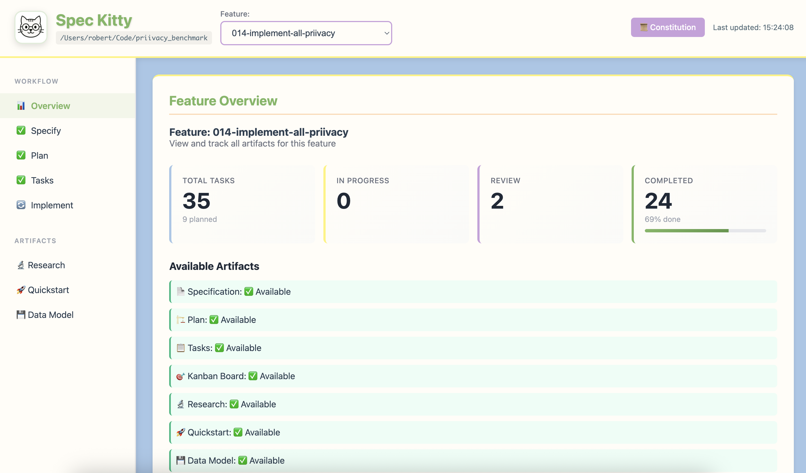
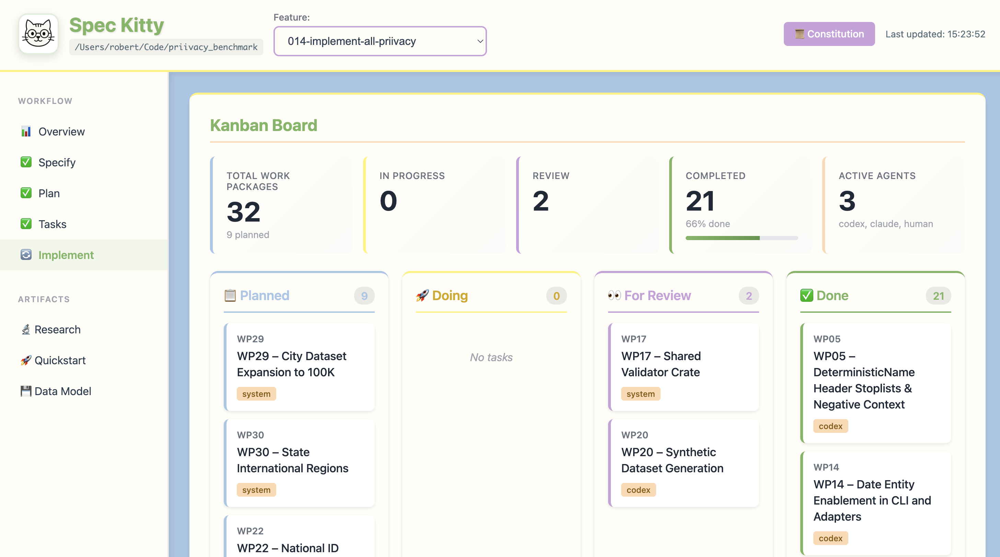

# How to Use the Spec Kitty Dashboard

The dashboard provides live, project-wide visibility into work packages, lanes, and agent activity. Start it on demand whenever you want to inspect progress.

## Starting the Dashboard

```bash
spec-kitty dashboard
# or
/spec-kitty.dashboard
```

If the dashboard isn't already running, Spec Kitty starts it in the background. Add `--open` if you want it to launch in your browser immediately:

```bash
spec-kitty dashboard --open
```

## Dashboard URL

Spec Kitty records the active dashboard URL in `.kittify/.dashboard`. If the browser doesn't open automatically, copy the URL from that file.

## Dashboard Views

### Kanban Board

The kanban board mirrors the lane workflow (`planned -> doing -> for_review -> in_review -> approved -> done`). `approved` means review passed and merge pending; `done` means merged/integrated.



### Feature Overview

The overview summarizes feature progress, artifacts, and worktrees.



## Custom Port

If you need a specific port, pass `--port`:

```bash
spec-kitty dashboard --port 8080
```

If the port is taken, Spec Kitty finds the next available port.

## Stopping the Dashboard

```bash
spec-kitty dashboard --kill
```

This stops the background process and clears the `.kittify/.dashboard` metadata.

## Dashboard Auto-Start

`spec-kitty init` does not auto-start the dashboard in the current `3.2` flow. If dashboard metadata is missing or stale, run `spec-kitty dashboard` again to recreate it.

---

## Command Reference

- [CLI Commands](../../../api/cli-commands.md) - Dashboard commands
- [Slash Commands](../../../api/slash-commands.md) - `/spec-kitty.dashboard`

## See Also

- [Parallel Development](../collaboration/parallel-development.md) - Monitor multi-agent work
- [Review a work package](../missions/review-work-package.md) - Track review status

## Background

- [Kanban Workflow](../../../architecture/kanban-workflow.md) - Lane system explained
- [Multi-Agent Orchestration](../../../architecture/multi-agent-orchestration.md) - Agent coordination

## Getting Started

- [Your First Mission](../../tutorials/your-first-mission.md) - See dashboard in action
- [Claude Code Integration](../../tutorials/claude-code-integration.md) - Dashboard with Claude
