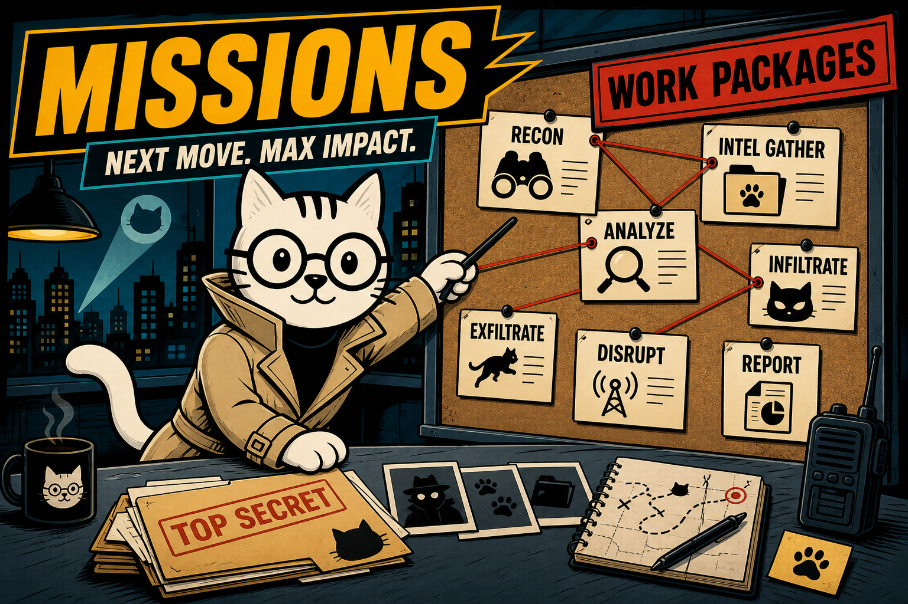

# Understanding Spec Kitty Missions

**Divio type**: Tutorial

Spec Kitty supports four mission types that tailor the workflow and artifacts to your goal.

**Time**: ~45 minutes
**Prerequisites**: Completed [Getting Started](getting-started.md)



_Stylized splash — the spy-themed cards are decorative. The four actual mission types (Software Dev, Deep Research, Documentation, Plan) are described below._

## What Is a Mission?

A mission selects the default templates, prompts, and outputs for your work. You choose it during `spec-kitty init` or when running `/spec-kitty.specify`. A mission is the unit that runs the whole spec-to-merge lifecycle; each mission decomposes into work packages (WPs) your agent implements one at a time — see [Your First Mission](your-first-mission.md) for that loop.

## The Four Mission Types

For the full purpose, phases, and required artifacts of each type, see [Mission Types](../../context/mission-types.md) — this page only covers what you need to pick one and get moving.

### Software Dev Kitty

Best for building software features and products.

Example use cases:

- New API endpoint
- UI feature development
- Performance improvements

### Deep Research Kitty

Best for structured research deliverables.

Example use cases:

- Competitive analysis
- Architecture decision research
- Technology evaluation

### Documentation Kitty

Best for creating or updating documentation sets.

Example use cases:

- End-user docs refresh
- API reference overhaul
- Internal playbooks

### Plan Kitty

Best for goal-oriented planning and strategy documents where you expect to iterate — not code, not docs.

Example use cases:

- Multi-quarter roadmap or strategy doc
- A structured decision/investigation writeup with a rollback-to-draft cycle
- Any goal-oriented plan you want gated by explicit review/approval rather than a code-review or publication gate

## Try It: Create a Research Mission

Create a project, then start the research mission:

```bash
spec-kitty init my-research-project --ai claude
cd my-research-project
```

Use `/spec-kitty.specify` with the research mission to start a research workflow.

In your agent:

```text
/spec-kitty.research Compare three task queue options for a Python service.
```

Expected results (abridged):

- `kitty-specs/###-task-queue-research/` directory
- Research artifacts defined by the mission templates

## How Missions Affect Your Workflow

- **Templates**: Each mission uses its own spec/plan/templates.
- **Artifacts**: Research missions create research notes; documentation missions generate Divio-oriented sections.
- **Validation**: Review criteria differ based on mission expectations.

## The Mission Lifecycle, Briefly

```
specify → plan → tasks → analyze → implement (per WP: claim → implement → review, with rejection cycles) → accept → merge
```

Every mission type — Software Dev, Deep Research, Documentation, and Plan — moves through this same loop; only the artifacts and templates change per type. For the full walkthrough with real commands, see [Your First Mission](your-first-mission.md).

## Troubleshooting

- **"Unknown mission"**: Use `spec-kitty mission list` to list available missions.
- **Missing `/spec-kitty.research`**: Your agent's command files are stale or weren't generated for this project. Run `spec-kitty upgrade` to regenerate them, then check `ls .claude/commands/` (or the equivalent directory for your agent) for `spec-kitty.research.md`.

## What's Next?

Explore the full workflow in [Your First Mission](your-first-mission.md) or dive deeper into specific missions.

### Related How-To Guides

- [Switch Missions](../how-to/missions/switch-missions.md) - Change mission types
- [Create a Specification](../how-to/missions/create-specification.md) - Start with any mission
- [Install and Upgrade](../how-to/installation/install-and-upgrade.md) - Initial setup options

### Reference Documentation

- [Missions](../../api/missions.md) - All mission types reference
- [CLI Commands](../../api/cli-commands.md) - Full command reference
- [Configuration](../../api/configuration.md) - Project settings
