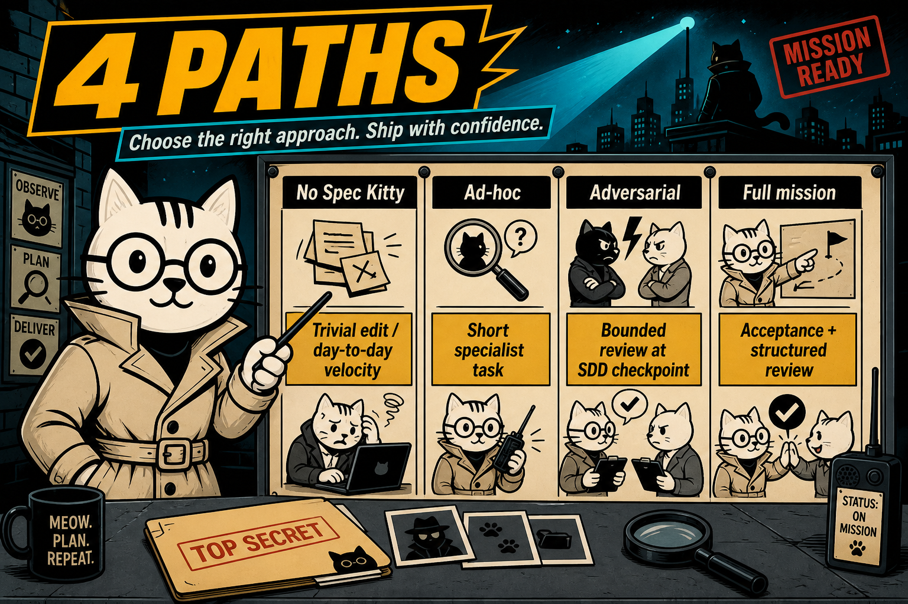
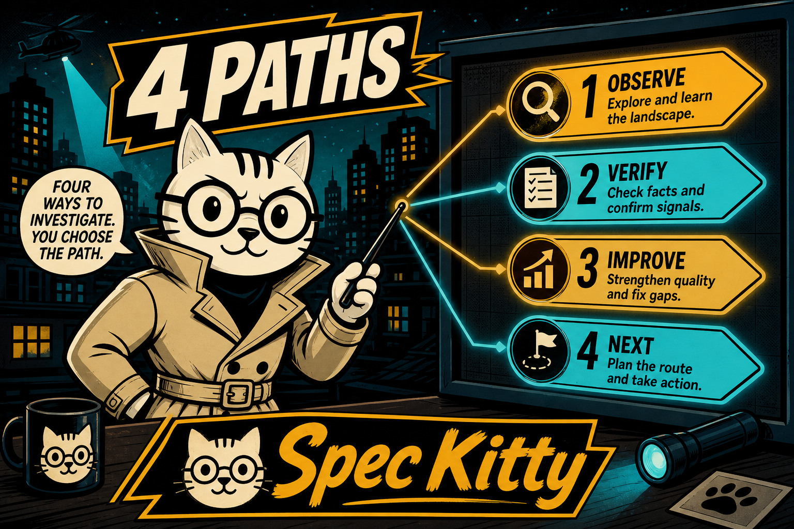

# When to use Spec Kitty modes

Choose the lightest path that still fits the work. Spec Kitty offers several entry points: skip it entirely for trivial edits, dispatch a specialist for a short task, run a bounded adversarial review at an SDD checkpoint, or drive a full mission when acceptance criteria and structured review matter.

## No Spec Kitty

**When:** Trivial edit / day-to-day velocity; human as primary orchestrator.

**Why:** Fixed mission overhead dominates small changes.

Use your editor and agent directly. Reserve Spec Kitty for work that benefits from tracked artifacts, governance, or review gates.

## Ad-hoc specialist session

**When:** Short task needing a specialist profile; no full Spec->Review.

**Why:** Use `spec-kitty dispatch`; lighter than a mission.

See [Start an ad-hoc specialist session](how-to/collaboration/adhoc-specialist-session.md) for examples and command syntax.

## Adversarial squad

**When:** Bounded multi-lens review at an SDD point-cut (post-spec / post-plan / post-tasks).

**Why:** Catch fakeability and scope issues without replacing the mission pipeline.

Run adversarial review when an artifact is ready for challenge but you are not starting a new mission. It complements, not replaces, Spec->Plan->Tasks->Implement->Review.

## Full mission

**When:** Multi-step change (new capability or a bug fix) with acceptance + structured review.

**Why:** Spec->Plan->Tasks->Implement->Review. Parallel agents are a mission capability, not a separate mode.

Expect bookkeeping commits as the mission advances work packages. See [Understanding Spec Kitty Missions](tutorials/missions-overview.md) and [Multi-agent workflow](tutorials/multi-agent-workflow.md) for mission setup and parallel work.

## Compare the four paths

## Alternate visuals

_Alternate stylized splash — the "Observe / Verify / Improve / Next" labels are decorative. The four actual paths are No Spec Kitty, Ad-hoc specialist, Adversarial squad, and Full mission, compared above._

## Related guides

- [Start an ad-hoc specialist session](how-to/collaboration/adhoc-specialist-session.md)
- [Understanding Spec Kitty Missions](tutorials/missions-overview.md)
- [Multi-agent workflow](tutorials/multi-agent-workflow.md)
