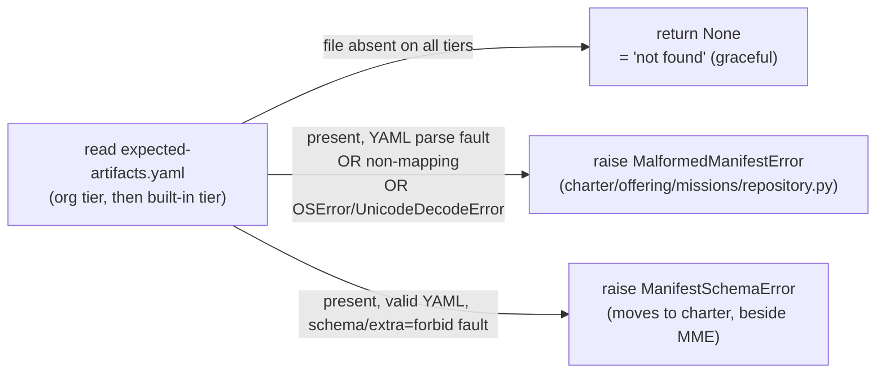

# Data Model — expected-artifacts-loader-unification

This mission adds no persisted data. The "model" here is the **error taxonomy**
and the **loader authority contract** — the invariants every load path must obey.

## Error taxonomy (the sibling model)

| Outcome | Trigger | Type | Home | Distinct from None? |
|---------|---------|------|------|---------------------|
| Absent | No file on any tier | `None` | — | — (this IS None) |
| Present-but-unparseable | YAMLError, non-mapping, or OSError/UnicodeDecodeError on an existing file | `MalformedManifestError` | `charter/offering/missions/repository.py` (existing) | **Yes** |
| Present-but-schema-invalid | Valid YAML, `extra="forbid"` / type violation | `ManifestSchemaError` | moves to `charter/offering/missions/repository.py` (from `specify_cli/dossier/manifest.py:104`) | **Yes** |

**Invariant I1**: absence ⇒ `None`; presence-with-any-fault ⇒ a raised sibling
error. The two are never conflated (FR-016 / #3412).

**Invariant I2**: both sibling errors carry an operator-actionable `str()` naming
the source (file path, or a descriptive org-tier origin when no single path
exists) and the underlying cause. `MalformedManifestError` message form:
`"Malformed … at {path}: {cause}"`. `ManifestSchemaError` keeps its
schema-specific message (NOT reused for parse faults).

**Invariant I3 (guard seam)**: neither sibling error is a subclass of, nor caught
by, the `UnregisteredMissionFamilyError` handler at
`runtime_bridge_composition.py:504`. A malformed manifest propagates past that
seam; it is never degraded to `[]`.

## Loader authority contract

`charter/activation/manifest_loader.py::load_manifest(mission_type, repo_root=None)`

- **Inputs**: `mission_type: str`, `repo_root: Path | None` (None ⇒ built-in tree
  only; today's default behavior).
- **Resolution order**: existing org roots (last-existing-match-wins, whole-file
  replacement) → built-in tree. Unchanged from today.
- **Returns**: `ExpectedArtifactManifest | None`. `None` ONLY for genuine absence.
- **Raises**: `MalformedManifestError` (present-but-unparseable, either tier),
  `ManifestSchemaError` (schema-invalid, either tier).
- **Cache**: private `_cache: dict[tuple[str, tuple[str, ...]], ExpectedArtifactManifest | None]`
  keyed `(mission_type, org_roots)` — preserves cross-repo-root non-shadowing and
  declaration order (NFR-002). Errors are NOT cached (only successful loads /
  genuine None).

## Delegates & consumers (post-consolidation)

| Site | Role after mission |
|------|--------------------|
| `specify_cli/dossier/manifest.py::ManifestRegistry.load_manifest` | thin delegate → charter authority; shim re-exports `load_manifest`, `ManifestSchemaError`, `MalformedManifestError`, `ManifestRegistry` |
| `specify_cli/runtime/resolver.py::_load_expected_artifact_manifest` | delegate → authority (FR-004) |
| `runtime/next/runtime_bridge_io.py::_presence_filenames_for` | authority → `project_artifact_name_set`; absent ⇒ `frozenset()`, malformed ⇒ propagate before projection (FR-005) |
| `charter/activation/mission_type_profiles.py::_resolve_expected_artifacts_slot` | authority; absent ⇒ `None`, malformed ⇒ raise before guard-table/None decision (FR-006) |
| `charter/.../expected_artifact_manifest.py::from_yaml_file` | DELETED (FR-013) |

## State transitions

None. Pure resolution; no lifecycle.
