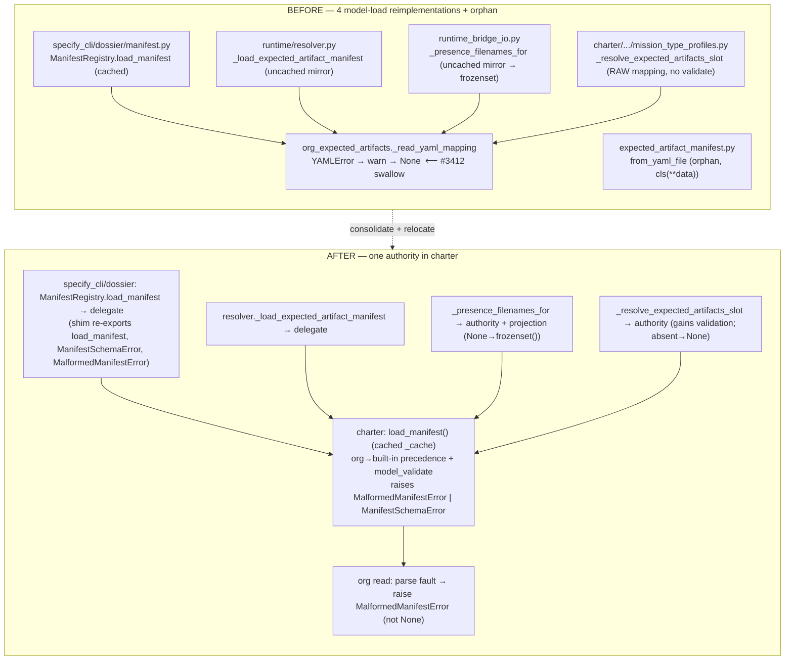

# Implementation Plan: Unify expected-artifacts.yaml Loading + Close Org-Tier Fail-Loud Gap

**Branch**: `fix/expected-artifacts-loader-unification` | **Date**: 2026-08-31 | **Spec**: [spec.md](./spec.md)
**Input**: Feature specification from `kitty-specs/expected-artifacts-loader-unification-01M1C9VQ/spec.md`

## Summary

Two paired issues in one load seam (#3770 structural + #3412 behavioral, epic
#3410). **Structural:** collapse four drifted reimplementations of the
`expected-artifacts.yaml` org→built-in-precedence + `model_validate` +
error-wrap logic (plus an orphan direct-read loader) into ONE cached authority.
The authority is **relocated into `charter`** — the enabling move, because
`C-001` forbids the charter-tier consumer from importing `specify_cli` where the
current authority lives. **Behavioral:** a YAML-syntax-broken (or non-mapping,
or present-but-unreadable) *org* manifest currently swallows to `None` and
two-stage-launders into a silent-green guard for custom families; make it fail
loud via the charter-resident `MalformedManifestError`, carried as a distinct
type the composed-guard seam cannot mistake for "unregistered family", and close
that seam by construction.

**Technical approach (settled by the research + post-spec squads):**
1. **Relocate** the cached loader *function* + `ManifestSchemaError` into
   `charter`; `MalformedManifestError` already lives there.
2. **Keep** `ManifestRegistry` in `specify_cli` as a thin delegate (it is a
   stateful class with sibling completeness methods, instantiated 4×); re-export
   `ManifestRegistry`, `load_manifest`, `ManifestSchemaError`,
   `MalformedManifestError` from the old path via a **deprecation shim**.
3. **Re-point** the resolver mirror, the runtime-bridge mirror, and the
   charter-tier raw-mapping loader at the one authority; **delete** the orphan
   `from_yaml_file`.
4. **Fail loud, symmetric:** org-tier parse/non-mapping/unreadable-present →
   `MalformedManifestError` (both tiers via FR-012); schema/`extra=forbid` →
   `ManifestSchemaError` (sibling). Neither is `None`.
5. **Close the launder seam:** pin `runtime_bridge_composition.py:504`'s `except`
   to `UnregisteredMissionFamilyError` only + a positive propagation regression.
6. **Gate by construction:** arch-gate forbidding bare `model_validate(` / bare
   `ExpectedArtifactManifest(` outside the canonical helper (allowlist → charter
   helper; model direct-construction tests exempt).

## Technical Context

**Language/Version**: Python 3.11+
**Primary Dependencies**: pydantic (v2 `model_validate`, `extra="forbid"`), ruamel.yaml (`YAMLError`); no new dependencies
**Storage**: N/A (reads `expected-artifacts.yaml` from doctrine/org-pack trees; in-process `_cache`)
**Testing**: pytest (unit + architectural gates); mypy (strict on new/moved surfaces); ruff
**Target Platform**: Linux/macOS CLI (spec-kitty)
**Project Type**: single (library + CLI)
**Performance Goals**: no new per-load I/O beyond the single existing file read (NFR-004); cache semantics unchanged (NFR-002)
**Constraints**: charter must not import `specify_cli` (C-001); do not mutate the `blocking_artifact_names` tri-state (C-002, #3729) or the guard-table short-circuit (C-003, #3386/#3397/#3407); ≤15 complexity per touched function; zero new lint/type debt
**Scale/Scope**: ~6 production modules touched (4 loaders + guard seam + built-in reader), 1 orphan deleted, 1 shim, 1 arch-gate, 1 ADR; ~10–15 tests added/migrated

## Constitution Check

*GATE: Must pass before Phase 0 research. Re-check after Phase 1 design.*

| Charter directive | Application to this mission | Status |
|-------------------|-----------------------------|--------|
| DIRECTIVE_001 (architectural integrity / shared-package boundary) | Relocation crosses the charter↔specify_cli seam; the loader + error types move so charter never imports specify_cli. ADR records the seam (C-005). | Planned via ADR |
| DIRECTIVE_044 (canonical sources & unification) | Central goal: one authority, not parity with drifted copies. | Aligned |
| DIRECTIVE_043 (close defect class by construction) | Two non-vacuous gates: bare-construction arch-gate (mirrors) + launder-seam pin (silent-green). Both with negative/positive cases. | Planned |
| DIRECTIVE_034 / 041 (test-first, red-first; tests as scaffold) | Real-YAML org repro RED on upstream/main before fix; green-stays-green tagged characterization, not `@regression`. | Planned |
| DIRECTIVE_025 (boy-scout / campsite) | Campsite-clean the touched loaders (stale docstring FR-014, dead org-root framing) as tidy-first. | Planned |
| DIRECTIVE_030 (test + typecheck quality gate) | ruff + mypy zero-new on touched/moved files (NFR-003). | Gate |
| DIRECTIVE_010 (specification fidelity) | FR→WP traceability preserved in tasks. | Gate |

No unjustified violations. The one structural boundary move (loader relocation)
is justified by C-001 and recorded in an ADR — see Complexity Tracking.

## Architecture: the load seam, before → after



**Launder-seam fix (behavioral core):** at `runtime_bridge_composition.py:486`
the guard *gathers* presence (outside the `:502-504` try); a `MalformedManifestError`
raised there propagates **before** the `blocking_artifact_names` None-vs-`frozenset`
decision (`cores.py:724`) — so it never enters the tri-state (C-002 satisfied).
The `except UnregisteredMissionFamilyError` at `:504` is pinned to that type
only, so the distinct malformed type is never degraded to `[]`.

## Project Structure

### Documentation (this mission)

```
kitty-specs/expected-artifacts-loader-unification-01M1C9VQ/
├── plan.md              # This file
├── research.md          # Phase 0 — decisions (scout + squad findings consolidated)
├── data-model.md        # Phase 1 — error-type sibling model + loader/authority contract
├── quickstart.md        # Phase 1 — how to witness the red-first repro + run the gates
├── contracts/           # Phase 1 — shim re-export surface, loader contract, guard-seam invariant
└── tasks.md             # Phase 2 (/spec-kitty.tasks — NOT created here)
```

### Source Code (repository root)

```
src/
├── charter/
│   ├── offering/missions/
│   │   ├── repository.py                 # MalformedManifestError (home); FR-012 widen unreadable
│   │   └── expected_artifact_manifest.py # FR-013 DELETE from_yaml_file
│   ├── activation/
│   │   ├── org_expected_artifacts.py     # FR-007 parse fault → raise (not warn→None)
│   │   └── mission_type_profiles.py      # FR-006 re-point _resolve_expected_artifacts_slot
│   └── <new home>/manifest_authority.py  # FR-001 relocated cached loader + ManifestSchemaError
├── specify_cli/
│   ├── dossier/manifest.py               # FR-002/FR-003 shim + ManifestRegistry thin delegate
│   └── runtime/resolver.py               # FR-004 retire mirror → delegate
└── runtime/next/
    ├── runtime_bridge_io.py              # FR-005 retire mirror → authority + projection
    └── runtime_bridge_composition.py     # FR-010 pin :504 except to UnregisteredMissionFamilyError

tests/
├── architectural/                        # FR-011 bare-construction gate (non-vacuous)
├── charter/ (offering/activation)        # FR-007/012/013 unit + org fail-loud
├── dossier/test_manifest.py              # NFR-002 cache chars via delegate; migrate from_yaml_file tests
└── runtime/                              # FR-010 launder propagation regression (RED-on-main)
```

**Structure Decision**: Single-project library layout. The one structural change
is introducing a charter-resident manifest-authority module and moving
`ManifestSchemaError` beside it, with a compatibility shim from the historical
`specify_cli/dossier/manifest` path. Exact charter sub-package for the new home
is a Phase-0 research item (candidates: `charter/offering/missions/` beside the
model + `MalformedManifestError`, vs a dedicated `charter/.../manifest_loader`).

## Complexity Tracking

| Violation | Why Needed | Simpler Alternative Rejected Because |
|-----------|------------|-------------------------------------|
| Cross-boundary relocation of the loader + `ManifestSchemaError` into `charter` | The charter-tier consumer (`mission_type_profiles`) cannot reach a `specify_cli`-resident authority without violating C-001; unifying all four requires the authority to live where charter can import it. | Scoped-to-3-mirrors leaves the 4th (charter-tier, unvalidated) reimplementation drifting and #3770 half-closed; a shared-helper-without-relocation still needs the shared code to live in charter, i.e. the same move with more indirection. Operator chose relocation (decision `01M1CBARZBBWVGWBTWRMHPP661`). |
| Two gates instead of one (arch-gate + launder-seam pin) | The `model_validate` arch-gate cannot police the `composition.py:504` launder (a broadened `except` reopens #3412 while the string-gate stays green). | A single model_validate gate leaves the real silent-green seam unguarded — the post-spec fail-loud lens proved the gap. |

## Parallel Work Analysis

### Dependency Graph

```
WP01 Foundation (SEQUENTIAL, blocks all): relocate cached loader + ManifestSchemaError → charter;
     ManifestRegistry thin delegate; deprecation shim re-exports (ManifestRegistry, load_manifest,
     ManifestSchemaError, MalformedManifestError). NFR-001/002 characterization green.
        │
        ├─► WP02 (parallel) Retire resolver mirror → delegate (FR-004)
        ├─► WP03 (parallel) Retire runtime-bridge mirror → authority + projection None→frozenset() (FR-005)
        ├─► WP04 (parallel) Re-point charter-tier slot (FR-006; absent→None, malformed→raise)
        │
   WP05 Behavioral fail-loud (depends WP01): org parse/non-mapping → MalformedManifestError (FR-007);
        widen built-in unreadable-present both tiers (FR-012). RED-first org repro.
        │
   WP06 Launder-seam closure (depends WP03+WP05): pin composition.py:504 to UnregisteredMissionFamilyError;
        positive propagation regression through composed guard (FR-009/FR-010). RED-first.
        │
   WP07 Gate by construction (depends WP01-WP04): bare model_validate/construction arch-gate,
        allowlist → charter helper, negative case + self-mutation (FR-011).
        │
   WP08 Docs + ADR + campsite (depends all): ADR for relocation (C-005), stale docstring (FR-014),
        CHANGELOG, quickstart; delete from_yaml_file + migrate tests (FR-013, can co-land WP01).
```

### Work Distribution

- **Sequential foundation**: WP01 (relocation + shim + delegate) must land before any re-point; it is the seam every other WP consumes.
- **Parallel streams**: WP02/WP03/WP04 (three independent re-points) after WP01; WP07 gate after the re-points.
- **Coupling to watch**: WP03 (runtime-bridge projection) and WP05 (org fail-loud) both feed WP06 (launder seam) — WP06 is the integration point that proves the end-to-end silent-green is gone.

### Coordination Points

- **Integration test**: WP06's composed-guard propagation regression is the cross-WP proof (org malformed → operator-visible, never `[]`).
- **Gate timing**: WP07's arch-gate lands only after WP02–WP04 delete the mirror `model_validate` calls and WP01 moves the canonical calls — else the allowlist trips on relocation or on surviving mirrors.
