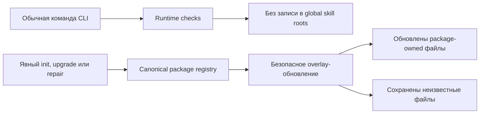

# План реализации: Безопасный глобальный bootstrap навыков

## Цель

Закрыть повторяющийся класс потери пользовательских файлов в user-global skill roots. Обычный CLI startup перестаёт быть владельцем записи. Явные install, upgrade и repair flows продолжают обновлять package-owned файлы, но не удаляют неизвестные соседние файлы. Собранный wheel должен содержать explicit-only metadata для legacy program skill.

## Текущее устройство и дефект

`src/specify_cli/__init__.py::main_callback` вызывает `ensure_global_agent_skills()` перед большинством обычных команд. `src/specify_cli/runtime/agent_skills.py::_sync_skill_root` удаляет каждый существующий canonical skill-каталог и копирует packaged tree. Общий marker учитывает только версию пакета. Поэтому разные runtime могут по очереди перепроецировать один `HOME` и уничтожать файлы, отсутствующие в текущем пакете.

`src/specify_cli/skills/installer.py::_sync_global_skill` повторяет тот же destructive replace во время явной установки. Этот путь должен соблюдать charter boundary: неизвестный путь без доказанного package ownership сохраняется.

## Целевая архитектура

### Владение

- `main_callback` владеет только безопасными startup checks и больше не запускает global skill refresh.
- `_sync_global_skill` становится единственным низкоуровневым владельцем обновления одного canonical skill.
- `runtime.agent_skills._sync_skill_root` делегирует обновление каждого навыка этому владельцу и сохраняет отдельный exact-name cleanup retired skills.
- Package source владеет файлами, присутствующими в source tree текущего skill.
- Existing destination paths, отсутствующие в source tree, считаются неизвестными и сохраняются.
- Exact collision по пути source-owned файла разрешается в пользу source: read-only файл временно делается writable, обновляется и снова защищается.

## Изменения по файлам

### Контракт startup

- `src/specify_cli/__init__.py`
  - удалить вызов `ensure_global_agent_skills()` и его импорт из обычного root callback;
  - оставить runtime bootstrap, version pin gates и slash-command behavior без изменений.
- `tests/runtime/test_bootstrap_unit.py`
  - acceptance test через root callback: обычная команда не вызывает global skill sync;
  - сохранить доказательство, что остальные startup checks продолжают вызываться.

### Контракт безопасной синхронизации

- `src/specify_cli/skills/installer.py`
  - заменить whole-directory replace на overlay только source paths;
  - безопасно обработать destination symlink/file collisions;
  - повторно сделать скопированные source-owned файлы read-only;
  - сохранить неизвестные файлы и каталоги.
- `src/specify_cli/runtime/agent_skills.py`
  - использовать общий installer seam вместо второй destructive реализации.
- `tests/specify_cli/skills/test_installer.py`
  - red-first tests для неизвестной metadata, read-only replacement, вложенного unknown path и постороннего skill.
- `tests/runtime/test_agent_skills.py`
  - интеграционная проверка version-marker refresh через общий seam.

### Контракт дистрибутива

- `tests/doctrine/test_spk_skill_pack.py`
  - проверить exact path `src/charter/offering/skills/spec-kitty-program-orchestrate/agents/openai.yaml`;
  - разобрать YAML и потребовать `allow_implicit_invocation: false`;
  - отдельная wheel verification после build проверяет тот же путь внутри архива.
- `pyproject.toml`
  - выполнить обязательный version bump для изменения `src/specify_cli/__init__.py`.
- `docs/changelog/CHANGELOG.md`
  - описать observable behavior и migration expectation.
- `docs/adr/3.x/2026-09-08-1-explicit-global-skill-refresh.md`
  - зафиксировать, что global skills остаются machine-level, но refresh становится явным и ownership-aware;
  - не менять принятое решение для user-global slash commands.

## ATDD и порядок коммитов

1. Добавить acceptance tests для ordinary startup, unknown-file preservation и distribution metadata.
2. Запустить их на planning base и сохранить ожидаемое падение по двум исходным дефектам. Metadata-test может быть зелёным на base из-за уже слитого PR #16; его mutation check должен доказать oracle.
3. Закоммитить только тесты отдельным red-first commit.
4. Реализовать startup boundary и безопасный overlay.
5. Добавить ADR, changelog и version bump.
6. Выполнить targeted tests, mutation checks, ruff, mypy и релевантные architectural gates.
7. Собрать wheel из финального task head, записать SHA-256 и проверить inventory.
8. Создать draft PR, дождаться CI, выполнить самостоятельное ревью и перевести PR в ready только при зелёных обязательных checks.
9. Подготовить HOSTKEY dry plan с текущими CAS fingerprints и artifact identity. Ничего не устанавливать.

## Риски и меры

| Риск | Мера |
|------|------|
| Скрытое изменение slash commands | Не менять `ensure_global_agent_commands()`; отдельный regression test сохраняет его вызов. |
| Сохранение устаревшего package-файла | Сохранять только пути, которых нет в текущем source tree; совпадающие source paths всегда обновлять. |
| Symlink traversal | Удалять только exact colliding symlink/file и не следовать неизвестным symlink paths. |
| Read-only destination | Делать writable только exact source-owned destination перед заменой. |
| Mixed-runtime повтор | Обычный startup больше не запускает skill sync; артефакт получает отдельную identity. |
| Случайная запись в настоящий HOME | Все CLI и fixture tests запускаются с изолированными `HOME`, `USERPROFILE` и `SPEC_KITTY_HOME`. |
| Старая непубликованная ветка | Не изменять и не интегрировать её; использовать только как историческую справку. |

## Проверки

- Targeted pytest для runtime bootstrap, skill installer и packaged policy.
- Counterfactual mutation: удалить вызов-защиту либо инвертировать policy и убедиться, что соответствующий тест падает.
- `ruff check` для изменённых Python-файлов.
- `mypy --strict` для изменённых модулей через проектную конфигурацию.
- `pytest tests/architectural/test_no_legacy_terminology.py`.
- `git diff --check`.
- Wheel build и zip-level проверка exact metadata.
- HOSTKEY read-only snapshot и локальная валидация dry plan.

## Delivery gates

- Source PR можно открыть и довести до ready после зелёных проверок.
- Merge выполняет оператор по правилам репозитория.
- GitHub/PyPI release не выполняется.
- HOSTKEY install, cleanup и scheduler остаются вне этой Mission.
